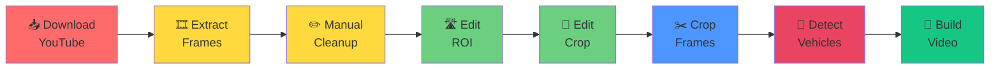

# User Guide

**Comprehensive workflows, examples, and common tasks**

---

## 📚 Quick Navigation

- [Workflows](#-workflows) — Pre-built task templates
- [Tools Reference](#-tools-reference) — Each tool explained
- [Common Tasks](#-common-tasks) — Single-purpose recipes
- [Tips & Tricks](#-tips--tricks) — Performance & quality

---

## 🎯 Workflows

### Workflow 1: Full Pipeline (Scratch to Finish)

**Goal:** Complete analysis from video download to CSV + annotated video

**Time:** 30–60 minutes (depending on video length and GPU)

```bash
# 1. Interactive menu (recommended)
adascope pipeline

# Select: a (all steps)
# Press Enter and follow prompts

# Or skip menu entirely:
adascope pipeline --full
```

**What happens:**


**Outputs:**
- ✅ `data/frames/raw/frame_*.jpg` — All extracted frames
- ✅ `outputs/roi_debug/debug.mp4` — Annotated video
- ✅ `outputs/roi_debug/states.csv` — Per-frame data
- ✅ `configs/detection.yaml` — Updated ROIs & crop box

---

### Workflow 2: Quick Preview (No Download)

**Goal:** Analyze an existing video file quickly

**Time:** 5–10 minutes

Assumes you have: `data/raw/your_video.mp4`

```bash
adascope pipeline --steps 2,4,5,7,8
```

This:
1. Extracts frames (step 2)
2. Let's you configure ROI (step 4)
3. Let's you configure crop (step 5)
4. Runs detection (step 7)
5. Builds output video (step 8)

**Skips:** YouTube download, manual cleanup

---

### Workflow 3: Single Frame Tuning

**Goal:** Perfect your ROI & crop settings on a single frame

**Time:** 5 minutes

```bash
# 1. Open ROI editor
adascope roi-editor --frame data/frames/raw/frame_000100.jpg

# Adjust polygons, save with S

# 2. Open crop selector
adascope crop-box --frame data/frames/raw/frame_000100.jpg

# Adjust crop box, save with S

# 3. Test on that frame
adascope detect --frame data/frames/raw/frame_000100.jpg
```

**Output:** Visualized detection on that one frame (helps debug)

---

### Workflow 4: Batch Re-Detection

**Goal:** Run detection on existing frames with new config

**Time:** 1–30 minutes (depending on frame count and GPU)

```bash
# Edit config as needed
# Then run:
adascope detect \
  --frames data/frames/raw \
  --csv outputs/roi_debug/states_v2.csv \
  --out-video outputs/roi_debug/debug_v2.mp4
```

**Useful for:**
- Testing different `conf` thresholds
- Trying different text prompts (`classes`)
- Re-tuning ROI or HSV thresholds

---

### Workflow 5: Extract Instrument Cluster Video

**Goal:** Crop the same region across all frames → build a clean cluster video

**Time:** 5 minutes (if crop box already set)

```bash
# 1. Ensure crop_box is set in configs/detection.yaml
adascope crop-box

# 2. Crop all frames
adascope crop \
  --frames data/frames/raw \
  --out data/frames/cropped

# 3. Build video from cropped frames
adascope assemble \
  --frames data/frames/cropped \
  --out outputs/videos/cluster_only.mp4 \
  --fps 25
```

**Output:** `cluster_only.mp4` — Just the instrument cluster at native FPS

---

### Workflow 6: Fast Video Preview

**Goal:** See detection results without processing every frame

**Time:** 2–5 minutes

```bash
adascope detect \
  --video data/raw/cluster_video.mp4 \
  --stride 5 \
  --out-video outputs/videos/preview.mp4
```

**What happens:**
- Processes every 5th frame (5x speedup)
- Output video plays 5x faster
- Great for debugging before full run

**Adjust stride:**
- `--stride 1` — Every frame (full video, ~2 fps on CPU)
- `--stride 5` — Every 5th (10 fps playback)
- `--stride 10` — Every 10th (20 fps playback)

---

## 🛠️ Tools Reference

### 1. roi_editor.py — Edit Lane Polygons

```bash
adascope roi-editor [OPTIONS]
```

**Options:**
```
--frame FRAME_PATH    Show this frame (default: frame_001784.jpg)
--config-dir CONFIG_DIR  Use config file (default: configs/detection.yaml)
```

**GUI Controls:**
| Key | Action |
|-----|--------|
| Left-drag | Move selected vertex |
| Right-click | Add vertex to ROI |
| D | Delete selected vertex |
| Tab | Cycle active ROI (left→ego→right→left) |
| S | Save changes to config |
| R | Reset to original (discard changes) |
| Q / Esc | Quit without saving |

**Output:** Updated `configs/detection.yaml` with new `rois:` section

**Example workflow:**
```bash
# Edit frame 100
adascope roi-editor --frame data/frames/raw/frame_000100.jpg

# Edit frame 500 (find the one with clearest lanes)
adascope roi-editor --frame data/frames/raw/frame_000500.jpg
```

---

### 2. crop_selector.py — Edit Crop Region

```bash
adascope crop-box [OPTIONS]
```

**Options:**
```
--frame FRAME_PATH    Show this frame (default: frame_001784.jpg)
--config-dir CONFIG_DIR  Use config file (default: configs/detection.yaml)
--preset NAME         Load preset (e.g., --preset full_frame)
```

**GUI Controls:**
| Key | Action |
|-----|--------|
| Left-drag | Move or resize crop box from any handle |
| Right-click | Reset to full frame |
| W | Move top edge up (keyboard control) |
| X | Move bottom edge down |
| A | Move left edge left |
| D | Move right edge right |
| S | Save changes to config |
| P | Save preview image to file |
| Q / Esc | Quit without saving |

**Output:** Updated `configs/detection.yaml` with new `crop_box:` field

**Typical crop box for Audi cluster:**
```yaml
crop_box: [0.135, 0.175, 0.865, 0.655]  # Normalized 0..1
```

---

### 3. detect.py — Run Detection Analysis

```bash
adascope detect [OPTIONS]
```

**Options:**
```
--frame FRAME_PATH              Analyze single frame
--frames DIR                    Analyze all frames in directory
--video VIDEO_PATH              Analyze video file
--config-dir CONFIG_DIR            Configuration file (default: configs/detection.yaml)
--model CHECKPOINT              Model weights (overrides config)
--classes CLASS1 CLASS2 ...     Text prompts (overrides config)
--conf THRESHOLD                Detection confidence 0..1 (default: from config)
--stride N                      Process every Nth frame (default: 1)
--csv OUTPUT_PATH               Save per-frame stats to CSV
--out-video OUTPUT_PATH         Save annotated video
```

**Examples:**

```bash
# Single frame
adascope detect --frame data/frames/raw/frame_000100.jpg

# All frames in directory
adascope detect --frames data/frames/raw \
  --csv outputs/states.csv \
  --out-video outputs/debug.mp4

# Video file (every frame)
adascope detect --video data/raw/cluster_video.mp4 \
  --out-video outputs/debug_full.mp4

# Fast preview (every 5th frame)
adascope detect --video data/raw/cluster_video.mp4 \
  --stride 5 \
  --out-video outputs/preview.mp4

# Custom model & prompts
adascope detect --frames data/frames/raw \
  --model models/yoloe-26l-seg.pt \
  --classes car vehicle truck \
  --conf 0.05
```

**Output:**
- Console: Per-frame vehicle counts + carpet status
- `--csv`: CSV file with per-frame data
- `--out-video`: MP4 with ROI overlays + detections

---

### 4. download.py — Fetch Video

```bash
adascope download [OPTIONS]
```

**Options:**
```
--url URL               YouTube URL (default: Audi assisted-lane-change)
--out OUTPUT_PATH      Output file (default: data/raw/cluster_video.mp4)
--height N             Maximum video height (default: 1080)
--ffmpeg-location PATH Folder containing ffmpeg
--force                Overwrite existing output
```

**Examples:**
```bash
# Default (Audi demo)
adascope download

# Custom URL
adascope download --url "https://youtu.be/XXXXXXXXX"

# Custom output
adascope download --out videos/my_video.mp4

# Explicit ffmpeg path
adascope download --ffmpeg-location "C:\ffmpeg\bin"
```

**Output:** MP4 video at 1080p / 25 fps

---

### 5. extract.py — Frame Extraction

```bash
adascope extract [OPTIONS]
```

**Options:**
```
--video VIDEO_PATH      Input video (required)
--out OUTPUT_DIR        Output directory (default: data/frames/raw)
--every N               Keep every Nth frame (default: 1 = all)
--max-frames N          Stop after N frames (default: 0 = no limit)
--fps RATE              Sample at this FPS (extracts in time, not frame count)
--ext FORMAT            Output format: jpg or png (default: jpg)
--quality QUALITY       JPEG quality 1-100 (default: 95)
```

**Examples:**
```bash
# Extract all frames
adascope extract --video data/raw/cluster_video.mp4

# Extract every 2nd frame (50% fewer files)
adascope extract --video data/raw/cluster_video.mp4 --every 2

# Sample at 2 fps (for 2-hour video → ~14,400 frames)
adascope extract --video data/raw/cluster_video.mp4 --fps 2

# PNG format (lossless, bigger files)
adascope extract --video data/raw/cluster_video.mp4 --ext png

# Extract only first 100 frames
adascope extract --video data/raw/cluster_video.mp4 --max-frames 100
```

**Output:** `data/frames/raw/frame_000000.jpg`, `frame_000001.jpg`, etc.

---

### 6. crop.py — Batch Crop Frames

```bash
adascope crop [OPTIONS]
```

**Options:**
```
--frames INPUT_DIR      Source frames (required)
--out OUTPUT_DIR        Output directory (default: data/frames/cropped)
--box X0 Y0 X1 Y1      Crop coordinates 0..1 (overrides config)
--config-dir CONFIG_DIR    Config file containing crop_box
--quality QUALITY       JPEG quality 1-100 (default: 95)
```

**Examples:**
```bash
# Use crop_box from config
adascope crop --frames data/frames/raw --out data/frames/cropped

# Override crop box
adascope crop --frames data/frames/raw \
  --box 0.1 0.2 0.9 0.8

# Lower JPEG quality (smaller files)
adascope crop --frames data/frames/raw --quality 85
```

**Output:** `data/frames/cropped/frame_000000.jpg`, etc.

---

### 7. assemble.py — Build Video from Frames

```bash
adascope assemble [OPTIONS]
```

**Options:**
```
--frames FRAME_DIR      Input frames directory (required)
--out OUTPUT_PATH       Output video (required)
--fps RATE              Output frame rate (default: 25)
--ext FORMAT            Only use files with this extension (jpg, png)
--fourcc CODEC          Video codec (default: mp4v)
```

**Examples:**
```bash
# Standard 25 fps
adascope assemble --frames data/frames/raw --out output.mp4

# 30 fps output
adascope assemble --frames data/frames/raw --out output.mp4 --fps 30

# From cropped frames only
adascope assemble --frames data/frames/cropped --out cluster.mp4

# PNG only (ignore JPGs)
adascope assemble --frames data/frames/raw --out output.mp4 --ext png
```

**Output:** `output.mp4` (playable with any video player)

---

## 🎯 Common Tasks

### Task 1: "My detections are terrible"

1. **Lower detection threshold:**
   ```yaml
   # configs/detection.yaml
   model:
     conf: 0.05  # Was 0.1, now more permissive
   ```

2. **Try broader text prompts:**
   ```yaml
   model:
     classes: [car, vehicle, truck]
   ```

3. **Check ROI polygons:**
   ```bash
   adascope roi-editor --frame data/frames/raw/frame_000100.jpg
   ```

4. **Visualize single frame:**
   ```bash
   adascope detect --frame data/frames/raw/frame_000100.jpg
   ```

---

### Task 2: "Crop box is wrong"

```bash
# Reset to full frame
adascope crop-box

# Right-click on the image to reset to full frame
# Then adjust, save with S
```

Or manually edit `configs/detection.yaml`:
```yaml
crop_box: [0.0, 0.0, 1.0, 1.0]  # Full frame
crop_box: [0.135, 0.175, 0.865, 0.655]  # Typical cluster crop
```

---

### Task 3: "Process is too slow"

```bash
# Preview with every 5th frame
adascope detect --video data/raw/cluster_video.mp4 \
  --stride 5 \
  --out-video preview.mp4

# Then full run only if results look good
adascope detect --video data/raw/cluster_video.mp4
```

---

### Task 4: "I only want the instrument cluster"

```bash
# 1. Set crop box
adascope crop-box

# 2. Crop frames
adascope crop --frames data/frames/raw --out data/frames/cropped

# 3. Build video
adascope assemble --frames data/frames/cropped --out cluster.mp4 --fps 25
```

---

### Task 5: "Re-analyze with different settings"

```bash
# Edit config
nano configs/detection.yaml

# Or use GUI:
adascope roi-editor
adascope crop-box

# Re-run detection
adascope detect --frames data/frames/raw \
  --csv outputs/states_v2.csv \
  --out-video outputs/debug_v2.mp4
```

---

## 💡 Tips & Tricks

### Performance Tips

**GPU Acceleration:**
- Install CUDA: Reduces time ~10x
- Check: `python -c "import torch; print(torch.cuda.is_available())"`

**CPU-only (slower but always works):**
- Set environment variable: `$Env:CUDA_VISIBLE_DEVICES = -1`

**Reduce memory usage:**
- Use smaller model: `yoloe-26m-seg.pt` instead of `yoloe-11l-seg.pt`
- Process with `--stride 5` for preview before full run

### Quality Tips

**Better detections:**
```yaml
model:
  classes: [car, vehicle, truck]  # Broader prompts
  conf: 0.05                      # Lower threshold
```

**Cleaner lane regions:**
- Use `roi_editor.py` on a frame with clear lane markings
- Make top points near vanishing point, bottom at near edge
- Test on multiple frames to ensure they cover the scene

**Stable carpet detection:**
- Run on a clean driving-scene frame (not menu/intro)
- Tune `carpet.min_frac` in config to balance sensitivity
- Verify `green_hsv` / `red_hsv` ranges match your source

### Debugging Tips

**Visualize single frame:**
```bash
adascope detect --frame data/frames/raw/frame_000100.jpg
```

**Preview first, then full:**
```bash
# Fast preview
adascope detect --video data/raw/video.mp4 --stride 5 --out-video preview.mp4

# Then full run if preview looks good
adascope detect --video data/raw/video.mp4 --out-video full.mp4
```

**Check frame extraction:**
```bash
# Verify frames were extracted
Get-ChildItem data\frames\raw\ | Measure-Object
# Should show frame count
```

**Export intermediate results:**
```bash
# Save only CSV (no video)
adascope detect --frames data/frames/raw --csv states.csv

# Save only video (no CSV)
adascope detect --frames data/frames/raw --out-video debug.mp4
```

---

## 📊 Understanding Output

### CSV Format

```
frame,veh_left,veh_ego,veh_right,state_left,state_ego,state_right
0,1,0,1,clear,drivable,clear
1,1,0,1,clear,drivable,clear
2,0,0,1,blocked,drivable,clear
```

**Columns:**
- `frame` — Frame index / filename
- `veh_left` / `veh_ego` / `veh_right` — count of **other** vehicles per lane
  (the ego car is excluded via `ego_box`, so `veh_ego` is usually 0)
- `state_left` / `state_right` — side-lane state: `available` (green), `blocked` (red), `clear`
- `state_ego` — ego-lane state: `drivable` (white path), `blocked`, `clear`

**Analysis example:**
```python
import pandas as pd

df = pd.read_csv('outputs/roi_debug/states.csv')

# Frames where a left lane change is offered
available = df[df['state_left'] == 'available']
print(f"Left change available in {len(available)} frames")

# Frames where the left lane is blocked (not drivable)
blocked = df[df['state_left'] == 'blocked']
print(f"Left blocked in {len(blocked)} frames")
```

---

## 🆘 FAQ

**Q: How long does a full run take?**  
A: Depends on GPU:
- GPU (CUDA): 5–20 min for 300 frames
- CPU: 30–120 min for 300 frames

**Q: Can I use a different video?**  
A: Yes! Put it in `data/raw/` and run steps 4,5,7,8.

**Q: What if I don't have `yt-dlp` / `ffmpeg`?**  
A: Skip step 1 (download). Use an existing video file.

**Q: How do I use a different YOLOE model?**  
A: Edit `configs/detection.yaml` or pass `--model models/yoloe-26l-seg.pt`

**Q: Can I train my own model?**  
A: Not directly. YOLOE is zero-shot (no training needed). See [05_DESIGN_AND_CONCEPTS.md](05_DESIGN_AND_CONCEPTS.md) for details.

---

**Need more help?** See [01_UNIFIED_GUIDE.md](01_UNIFIED_GUIDE.md) for documentation map.
