# Architecture & Design

**System design, data flow, module organization, and configuration**

---

## 🏗️ System Overview

```mermaid
graph TB
    subgraph "Input"
        A["🎬 Video File"]
    end
    
    subgraph "Processing Pipeline"
        B["🎞️ Frame Extraction\n(extract.py)"]
        C["✏️ Manual Cleanup\n(file explorer)"]
        D["🛣️ ROI Configuration\n(roi_editor.py)"]
        E["📍 Crop Configuration\n(crop_selector.py)"]
        F["✂️ Frame Cropping\n(crop.py)"]
    end
    
    subgraph "Analysis"
        G["🚗 Detection\n(detect.py)"]
        H["🟢🔴 Lane Status\n(detect.py)"]
    end
    
    subgraph "Output"
        I["📊 CSV Export\n(states.csv)"]
        J["🎥 Video Output\n(assemble.py)"]
    end
    
    subgraph "Configuration"
        K["⚙️ config.yaml\n(ROI, HSV, model)"]
    end
    
    A --> B --> C --> D
    D --> E --> F
    F --> G --> H
    G --> I
    G --> J
    D & E & K --> G
    
    style A fill:#1a1a2e
    style B fill:#0f3460
    style C fill:#0f3460
    style D fill:#6bcf7f
    style E fill:#6bcf7f
    style F fill:#4d96ff
    style G fill:#e94560
    style H fill:#e94560
    style I fill:#16c784
    style J fill:#16c784
    style K fill:#ffd93d
```



---

## 📁 Directory Structure & Responsibilities

```
YOLOE/
│
├── config/                          # Configuration storage
│   └── config.yaml                  # ⭐ Central config: ROIs, thresholds, model
│
├── models/                          # YOLOE model weights
│   ├── yoloe-11l-seg.pt            # Standard model (1.1 GB)
│   └── yoloe-11l-seg-pf.pt         # Prompt-free variant
│
├── adascope/                  # ⭐ Installable package (pip install -e .)
│   ├── __init__.py                  # Public API (Config, YoloeDetector, analyse_frame, draw)
│   ├── config.py                    # Typed Config schema + comment-preserving writers
│   ├── geometry.py                  # frac->pixel polygons, ROI assignment (pure)
│   ├── carpet.py                    # HSV carpet detection (pure)
│   ├── detector.py                  # Detector port + YoloeDetector adapter
│   ├── analysis.py                  # FrameResult + analyse_frame (domain core)
│   ├── render.py                    # Debug overlay drawing
│   ├── frames.py                    # All frame/video I/O (single source)
│   ├── states.py                    # states.csv writer
│   ├── paths.py                     # Canonical project paths
│   └── cli/                         # Thin CLI adapters
│       ├── __main__.py              # `adascope <command>` dispatcher
│       ├── detect.py crop.py extract.py assemble.py download.py
│       ├── roi_editor.py crop_selector.py   # GUI tools
│       └── pipeline.py              # In-process orchestrator
│
├── tests/                           # Unit tests (pure logic, FakeDetector)
├── __main__.py (in package)         # enables `python -m adascope`
│
├── data/                            # Data storage (gitignored)
│   ├── raw/                         # Downloaded videos
│   └── frames/
│       ├── raw/                     # Extracted frames
│       └── cropped/                 # Cropped frames
│
├── outputs/                         # Results (gitignored)
│   ├── roi_debug/                   # Detection results
│   │   ├── debug.mp4                # Annotated video
│   │   └── states.csv               # Per-frame data
│   ├── analysis/                    # Analysis artifacts
│   └── videos/                      # Output videos
│
├── docs/                            # Complete documentation
│   ├── 01_UNIFIED_GUIDE.md             # Unified project guide
│   ├── 02_GETTING_STARTED.md           # Setup & first run
│   ├── 03_USER_GUIDE.md                # Workflows & tools
│   ├── 04_ARCHITECTURE.md              # This file
│   ├── 05_DESIGN_AND_CONCEPTS.md       # Concepts & theory
│   ├── 06_API_REFERENCE.md             # Detailed reference
│   ├── 07_YOLOE_CONCEPTS.md            # YOLOE background
│   └── 08_ASSISTED_LANE_CHANGE_CASE_STUDY.md
│
└── run_pipeline.py                  # ⭐ Main interactive orchestrator
```

---

## 🔄 Data Flow

### Step 1: Video Input

```
YouTube URL or local MP4
        ↓
  download.py (optional)
        ↓
  data/raw/cluster_video.mp4
```

**Handled by:** `adascope download`  
**Config:** None required (YouTube download is self-contained)  
**Output:** MP4 video, 1920×1080, 25 fps

---

### Step 2: Frame Extraction

```
  data/raw/cluster_video.mp4
        ↓
  extract.py
        ↓
  data/frames/raw/frame_000000.jpg
  data/frames/raw/frame_000001.jpg
  ... (one per video frame)
```

**Handled by:** `adascope extract`  
**Config:** None required  
**Output:** JPEG frames, zero-padded filenames  

**Key parameters:**
- `--every N` — Keep every Nth frame (skip slow-motion sections)
- `--fps 2` — Sample at 2 fps instead of all frames
- `--quality 95` — JPEG compression (0-100)

---

### Step 3: Configuration (Manual)

User runs GUI tools to set parameters:

```
User launches roi_editor.py
        ↓
[Adjusts lane polygons on frame]
        ↓
Saves to: configs/detection.yaml
        ↓
User launches crop_selector.py
        ↓
[Adjusts crop region on frame]
        ↓
Saves to: configs/detection.yaml (crop_box field)
```

**Outputs:** Updated `configs/detection.yaml`

---

### Step 4: Frame Cropping

```
  data/frames/raw/frame_*.jpg
  + configs/detection.yaml (crop_box field)
        ↓
  crop.py
        ↓
  data/frames/cropped/frame_*.jpg
```

**Handled by:** `adascope crop`  
**Reads:** `crop_box` from config  
**Output:** Cropped frames (e.g., instrument cluster only)

---

### Step 5: Detection & Analysis

```
  data/frames/raw/frame_*.jpg
  + configs/detection.yaml (ROIs, model, HSV thresholds)
        ↓
  detect.py
        ├─→ YOLOE inference (load model + detect vehicles)
        ├─→ ROI assignment (assign boxes to left/ego/right)
        ├─→ HSV carpet detection (green/red lane status)
        └─→ Frame annotation (draw overlays)
        ↓
  Per-frame outputs:
  ├─ states.csv (vehicle count + carpet status)
  ├─ annotated frames (debug visualization)
  └─ debug.mp4 (assembled annotated video)
```

**Handled by:** `adascope detect`  
**Reads:** `config.yaml` (ROIs, model, classes, conf, HSV ranges)  
**Outputs:**
- `states.csv` — Per-frame data
- `debug.mp4` — Annotated video

---

## ⚙️ Configuration (config.yaml)

The single source of truth for analysis parameters:

```yaml
# ==== Model Selection & Inference ====
model:
  checkpoint: yoloe-11l-seg.pt       # Model weights file
  classes: [car]                     # Text prompts (0-shot)
  conf: 0.1                          # Detection threshold 0..1

# ==== Lane Regions (ROI Polygons) ====
# Each ROI is a perspective polygon with normalized (0..1) coordinates
# Order matters: vehicles assigned to first matching ROI
rois:
  left:                              # Left lane
    - [0.45, 0.27]                  # Top-left point (near vanishing point)
    - [0.48, 0.27]                  # Top-right
    - [0.44, 0.49]                  # Bottom-left
    - [0.33, 0.49]                  # Bottom-right (wider at near edge)
  
  ego:                               # Ego/center lane
    - [0.47, 0.31]
    - [0.52, 0.31]
    - [0.54, 0.47]
    - [0.45, 0.47]
  
  right:                             # Right lane
    - [0.51, 0.26]
    - [0.54, 0.26]
    - [0.66, 0.49]
    - [0.55, 0.49]

# ==== Crop Box (Instrument Cluster) ====
# Normalized coordinates [x0, y0, x1, y1] (0=left/top, 1=right/bottom)
crop_box: [0.135, 0.175, 0.865, 0.655]

# ==== ROI Colors (for visualization) ====
roi_colors:
  left: [255, 180, 0]                # BGR (OpenCV format)
  ego: [255, 255, 255]               # White
  right: [0, 180, 255]               # Orange

# ==== Carpet Detection (Lane Status) ====
# HSV color thresholds for green/red/white detection
# H: 0-179, S: 0-255, V: 0-255 (OpenCV convention)
carpet:
  detect_in: [left, right]           # Which ROIs to check for carpet
  min_frac: 0.04                     # Min pixel fraction to count as carpet
  white_min_frac: 0.18               # Higher threshold for white (lane lines)
  
  green_hsv:                         # Lane available
    - [38, 70, 70]                   # [H_min, S_min, V_min]
    - [90, 255, 255]                 # [H_max, S_max, V_max]
  
  red_hsv:                           # Lane blocked
    - [[0, 90, 80], [12, 255, 255]]  # Red wraps hue circle, two ranges
    - [[168, 90, 80], [180, 255, 255]]
  
  white_hsv:                         # Adjacent lane
    - [0, 0, 95]
    - [179, 45, 170]
```

**Key design decisions:**

1. **Normalized coordinates (0..1):**
   - Resolution-independent
   - Same config works at 720p, 1080p, 4K
   - Points specified as fractions

2. **Perspective polygons for ROIs:**
   - Top points narrow (near vanishing point)
   - Bottom points wide (near camera)
   - Follows actual lane geometry

3. **HSV for carpet detection:**
   - More reliable than learned detector for synthetic overlays
   - Tuned to Audi green/red carpet colors
   - Adjustable with min_frac for sensitivity

---

## 🚀 Main Orchestrator (run_pipeline.py)

Interactive menu for running all steps:

```python
# Step definitions (each runs a command)
step_1_download()    # YouTube → MP4
step_2_extract()     # MP4 → frames
step_3_cleanup()     # Manual file explorer
step_4_roi()         # roi_editor.py
step_5_crop_config() # crop_selector.py
step_6_crop()        # crop.py
step_7_detect()      # detect.py
step_8_output()      # assemble.py
```

**Features:**
- Interactive menu (select steps, or 'a' for all)
- Dependency checking (verifies files exist before running)
- Error handling (stops on first error by default)
- Resume capability (skip completed steps, restart from any point)

---

## 🔌 Detector Port & Adapter (adascope/detector.py)

The pure analysis layer depends on a `Detector` **port** (a Protocol), never on
`ultralytics` directly. `YoloeDetector` is the **adapter** and is the single owner
of the YOLOE text-prompt setup:

```python
class Detector(Protocol):
    def detect(self, frame: np.ndarray, conf: float) -> list[BBox]: ...

class YoloeDetector:
    def __init__(self, checkpoint: str, classes: list[str] | None = None):
        from ultralytics import YOLOE
        self.model = YOLOE(checkpoint)
        if classes:                          # pre-compute text embeddings once
            embeddings = self.model.get_text_pe(classes)
            self.model.set_classes(classes, embeddings)

    def detect(self, frame, conf):
        results = self.model.predict(frame, conf=conf, verbose=False)
        det = sv.Detections.from_ultralytics(results[0])
        return [BBox(int(a), int(b), int(c), int(d)) for a, b, c, d in det.xyxy]
```

**Why a port + adapter (not just a `load_model` wrapper)?**

- Decouples the domain logic from YOLOE → `analyse_frame` is unit-testable with a
  `FakeDetector`, no 70 MB model load.
- Centralizes the non-obvious text-embedding setup in exactly one place.
- See [decisions/ADR-0001-package-layout-and-ports.md](decisions/ADR-0001-package-layout-and-ports.md).

---

## 🎯 Detection Pipeline (adascope.vision.analysis)

Core analysis logic:

```mermaid
graph TB
    A["Load config\n(ROIs, model, classes, HSV)"] --> B["Load YOLOE model"]
    B --> C["For each frame:"]
    C --> D["1. YOLOE inference\n(detect vehicles)"]
    D --> E["2. Assign to ROI\n(check polygon membership)"]
    E --> F["3. Detect carpet color\n(HSV thresholding)"]
    F --> G["4. Draw annotations\n(overlays, labels)"]
    G --> H["5. Export data\n(CSV row, video frame)"]
    
    style A fill:#ffd93d
    style B fill:#ff6b6b
    style C fill:#4d96ff
    style D fill:#e94560
    style E fill:#e94560
    style F fill:#6bcf7f
    style G fill:#0f3460
    style H fill:#16c784
```



**Detailed steps:**

1. **Load YOLOE model** from checkpoint
2. **For each frame:**
   - **YOLOE inference:** Run model, get detections (boxes + confidence)
   - **ROI assignment:** For each box, find which polygon contains its center
   - **Carpet detection:** Apply HSV masks to ROI regions, check pixel fractions
   - **Annotation:** Draw polygons, boxes, labels, carpet status
   - **Export:** Write CSV row + video frame

---

## 📊 CSV Output Schema

```csv
frame,veh_left,veh_ego,veh_right,state_left,state_ego,state_right
0,1,0,1,clear,drivable,clear
1,1,0,1,clear,drivable,clear
2,0,0,1,blocked,drivable,clear
```

**Column definitions:**

| Column | Type | Values | Meaning |
|--------|------|--------|---------|
| `frame` | int/str | index or filename | Frame identifier |
| `veh_left` | int | 0, 1, 2, ... | **Other** vehicle count in left lane |
| `veh_ego` | int | 0, 1, 2, ... | Other vehicle count in ego lane (ego car excluded via `ego_box`, usually 0) |
| `veh_right` | int | 0, 1, 2, ... | Other vehicle count in right lane |
| `state_left` | str | available / blocked / clear | Side-lane drivable state (green / red / none) |
| `state_ego` | str | drivable / blocked / clear | Ego-lane state (white path / red / none) |
| `state_right` | str | available / blocked / clear | Side-lane drivable state (green / red / none) |

**Status meanings:**
- `green` — Lane is clear and available for lane change
- `red` — Lane is blocked (vehicle present or other obstacle)
- `clear` — No carpet signal detected (normal road, not special zone)

---

## 🎨 GUI Tools Architecture

### roi_editor.py

```mermaid
graph TB
    A["Load frame + config"] --> B["Display frame"]
    B --> C["Mouse/keyboard input"]
    C --> D["Vertex dragging\nVertex creation\nVertex deletion"]
    D --> E["Update polygons"]
    E --> F["Redraw + update display"]
    F --> C
    C -->|User presses S| G["Save to config.yaml"]
    C -->|User presses Q| H["Exit"]
    
    style A fill:#ffd93d
    style B fill:#0f3460
    style C fill:#4d96ff
    style D fill:#e94560
    style E fill:#6bcf7f
    style F fill:#0f3460
    style G fill:#16c784
    style H fill:#ff6b6b
```



**Features:**
- OpenCV window with mouse callbacks
- Vertex manipulation (move, add, delete)
- ROI cycling (Tab key)
- Real-time visualization
- Save/reset/quit commands

### crop_selector.py

```mermaid
graph TB
    A["Load frame + config"] --> B["Display frame + crop box"]
    B --> C["Mouse/keyboard input"]
    C --> D["Box dragging\nHandle resizing\nEdge manipulation"]
    D --> E["Update crop_box"]
    E --> F["Redraw with new crop"]
    F --> C
    C -->|User presses S| G["Save to config.yaml"]
    C -->|Right-click| H["Reset to full frame"]
    C -->|W/X/A/D| I["Fine-tune edges"]
    C -->|User presses Q| J["Exit"]
    
    style A fill:#ffd93d
    style B fill:#0f3460
    style C fill:#4d96ff
    style D fill:#e94560
    style E fill:#6bcf7f
    style F fill:#0f3460
    style G fill:#16c784
    style H fill:#ff6b6b
    style I fill:#4d96ff
    style J fill:#ff6b6b
```



**Features:**
- Draggable crop box with corner handles
- Edge detection for easier grabbing
- Keyboard shortcuts for fine-tuning
- Preview generation
- Bounds checking

---

## 📈 Performance Characteristics

| Operation | Time (GPU) | Time (CPU) | Notes |
|-----------|-----------|-----------|-------|
| Frame extraction | — | 30 sec (100 frames) | Depends on disk speed |
| ROI/crop config | — | 2 min (interactive) | Real-time GUI |
| YOLOE inference | 0.1 s/frame | 0.5 s/frame | Varies by model size |
| Carpet detection | 0.02 s/frame | 0.02 s/frame | HSV thresholding, fast |
| Video assembly | 0.01 s/frame | 0.01 s/frame | I/O bound |
| **Full 300-frame run** | **15-20 min** | **30-45 min** | CPU-only is practical |

**Optimization strategies:**
- Use GPU if available (10x speedup)
- Use smaller model (`-m` variant) for CPU-only
- Process with `--stride 5` for fast preview
- Use PNG extraction only if lossless is critical

---

## 🔐 Design Principles

### 1. **Configuration as Code**
- All tuning in `config.yaml`, not hardcoded
- No code edits needed to try new parameters
- Self-documenting config file

### 2. **Normalized Coordinates**
- All ROI/crop coordinates are 0..1 fractions
- Resolution-independent (works at any size)
- Easy to transfer configs between videos

### 3. **Modular Pipeline**
- Each step is a separate script
- Can run individually or orchestrated
- Easy to insert custom steps

### 4. **Interactive Tuning**
- GUI tools for ROI & crop adjustment
- Real-time visualization
- Save/reload without rewriting code

### 5. **Composable Outputs**
- Frames can be recropped
- Video can be reassembled
- CSV can be post-processed

---

## 🚨 Error Handling

**Graceful degradation:**

| Error | Handling |
|-------|----------|
| Missing config | Use defaults |
| Missing model | Error + exit |
| Crop outside bounds | Clamp to bounds, warn |
| No detections | CSV row with zeros |
| Frame not found | Skip or error (depends on context) |

---

## 📚 Module Dependencies

```mermaid
graph LR
    A["adascope.vision.analysis"] --> B["configs/detection.yaml"]
    A --> C["adascope.detection\n(Detector port)"]
    C --> D["ultralytics\n(YOLOE)"]
    C --> E["supervision\n(post-processing)"]
    A --> F["opencv-python\n(cv2)"]
    A --> G["adascope.config\n(pyyaml)"]
    
    H["cli.roi_editor"] --> B
    H --> F
    
    I["cli.crop_selector"] --> B
    I --> F
    
    J["cli.extract"] --> F
    J --> K["tqdm\n(progress)"]
    
    style A fill:#e94560
    style B fill:#ffd93d
    style C fill:#6bcf7f
    style D fill:#ff6b6b
    style E fill:#ff6b6b
    style F fill:#0f3460
    style G fill:#0f3460
    style H fill:#0f3460
    style I fill:#0f3460
    style J fill:#4d96ff
    style K fill:#4d96ff
```



---

**Next:** [06_API_REFERENCE.md](06_API_REFERENCE.md) for detailed tool options
