# YOLOE Design & Concepts

**Understanding the theory, YOLOE architecture, and design decisions**

---

## Table of Contents

- [YOLOE Basics](#-yoloe-basics) — Open-vocabulary detection
- [Architecture](#-architecture) — How YOLOE works
- [Prompting Modes](#-prompting-modes) — Text, visual, and free
- [Lane Region Analysis](#-lane-region-analysis) — ROI polygon design
- [Carpet Detection](#-carpet-detection) — HSV thresholding
- [Design Decisions](#-design-decisions) — Why these choices
- [References](#-references) — Papers and links

---

## 🚀 YOLOE Basics

### What is YOLOE?

**YOLOE** = **Y**OLO **E**xtended (or "Real-Time Seeing Anything")

Traditional YOLO detects a fixed set of ~80 classes (cars, dogs, chairs, ...). YOLOE is **open-vocabulary**:

```
Traditional YOLO:
  Input: Image
  → Model (frozen)
  → Output: [car, dog, chair, ...] from 80 classes
  
YOLOE:
  Input: Image + prompts ("car", "vehicle")
  → Model (flexible vocabulary)
  → Output: Detections of anything matching your prompts
```

### Key Innovation: Text Embeddings

Instead of fixed class scores, YOLOE compares visual features to **text embeddings**:

```
1. User provides text prompts: ["car", "truck"]
2. MobileCLIP encoder converts to embeddings
3. YOLOE compares each detection to these embeddings
4. Output: Detections matching the prompts
```

**Why text?**
- Flexibility: Change "car" to "vehicle" without retraining
- Specificity: Use domain knowledge ("sedan", "white car")
- Language: Supports 100+ languages

---

## 🏗️ Architecture

```mermaid
graph TB
    A["Input Image\n(1920×1080)"] --> B["Backbone\n(ResNet-like)"]
    B --> C["Neck\n(Feature Pyramid)"]
    C --> D["Detection Head\n(YOLOE-specific)"]
    D --> E["Text Embeddings\n(MobileCLIP)"]
    E --> F["Similarity Scoring\n(cosine distance)"]
    F --> G["Post-processing\n(NMS)"]
    G --> H["Output Boxes\n(x, y, w, h, conf)"]
    
    style A fill:#1a1a2e
    style B fill:#0f3460
    style C fill:#0f3460
    style D fill:#e94560
    style E fill:#e94560
    style F fill:#e94560
    style G fill:#4d96ff
    style H fill:#16c784
```



**Stages:**

1. **Backbone** — Extract features from image (ResNet/YOLO backbone)
2. **Neck** — Combine multi-scale features (Feature Pyramid Network)
3. **Detection Head** — Predict bounding boxes + objectness
4. **Text Embedding** — Convert user prompts to embeddings (MobileCLIP)
5. **Similarity Scoring** — Compare detections to prompt embeddings
6. **Post-processing** — Non-maximum suppression (remove duplicates)
7. **Output** — Final boxes with confidence scores

---

## 🎯 Prompting Modes

### Mode 1: Text Prompts (This Project)

```python
classes = ["car"]
model.set_classes(classes, embeddings)
```

**Pros:**
- Flexible, no retraining
- Works across domains
- Language-agnostic

**Cons:**
- Abstract (hard to name things)
- Can be ambiguous ("car" ≠ "vehicle")

**Best for:** Clear object categories (car, truck, bus)

---

### Mode 2: Visual Prompts

```python
# Provide reference image or box
ref_box = crop_reference_image()
model.set_visual_prompt(ref_box)
```

**Pros:**
- Precise (works for hard-to-name things)
- No interpretation needed
- Visual ground truth

**Cons:**
- Requires reference image
- One prompt per reference

**Best for:** Specific things (the green arrow symbol, specific car model)

---

### Mode 3: Prompt-Free (-pf models)

```
model = YOLOE("yoloe-11l-seg-pf.pt")
# No prompts needed — detects 4500+ classes
```

**Pros:**
- No prompting required
- Exploratory "what's in this frame"
- Covers diverse objects

**Cons:**
- Slower (more classes to evaluate)
- Noisier output (more false positives)
- Hard to filter results

**Best for:** Exploration, understanding scenes

---

## 🛣️ Lane Region Analysis

### Why Perspective Polygons?

Lanes don't appear as rectangles on a 2D image — they follow **3D perspective**:

```
3D World (top view):      2D Image (camera view):
┌─────────────┐           
│ L │ E │ R   │           ╱─────────────╲
│ ───────────  │           │ L │ E │ R   │
│ ═════════════│           └─────────────┘
│ ═════════════│                         (wider at near edge)
│ ═════════════│
│ ═════════════│
│ ═════════════│
└─────────────┘
(many cars)
```

**Solution: Perspective polygons**

Top points are narrow (near vanishing point), bottom points are wide (near camera):

```
ROI polygon (left lane):
  [0.45, 0.27] ───────────────────── [0.48, 0.27]
     Top-left            Top-right
         │                    │
         │                    │
         │                    │
         │                    │
  [0.44, 0.49] ───────────────────── [0.33, 0.49]
  Bottom-left          Bottom-right
      (wider)
```

### Vehicle Assignment Algorithm

```python
for detection in detections:
    box_center = (detection.x_center, detection.y_center)
    
    for roi_name in [left, ego, right]:  # Test in order
        if point_in_polygon(box_center, roi[roi_name]):
            assign_to_roi(detection, roi_name)
            break  # First match wins
```

**Why order matters:**
- Left tested first, ego second, right third
- Overlapping regions use first match
- Prevents assignment ambiguity

---

## 🟢🔴 Carpet Detection

### The Challenge

The Audi demo shows a "carpet" (driving area indicator):
- **Green** = lane available for change
- **Red** = lane blocked/aborted
- **White** = normal road markings

This is **synthetic** (rendered in UI), so **color is reliable**:

```mermaid
graph LR
    A["Frame"] --> B["Apply HSV masks"]
    B --> C["Count pixels\nper ROI"]
    C --> D["Compute fractions"]
    D --> E["Compare to threshold"]
    E --> F["Decision:\ngreen/red/clear"]
    
    style A fill:#1a1a2e
    style B fill:#e94560
    style C fill:#e94560
    style D fill:#4d96ff
    style E fill:#4d96ff
    style F fill:#16c784
```



### HSV Color Space

Why HSV instead of RGB?

**RGB:** Color varies with brightness
```
Bright red:   [255, 0, 0]
Dark red:     [128, 0, 0]
(same color, different values)
```

**HSV:** Color independent of brightness
```
Bright red:   H=0, S=255, V=255
Dark red:     H=0, S=255, V=128
(same H, S but different V)
```

→ Single HSV range captures all shades of a color

### Implementation

```python
# Define HSV ranges for green (example)
green_lower = (38, 70, 70)       # H, S, V minimums
green_upper = (90, 255, 255)     # H, S, V maximums

# Create mask
mask = cv2.inRange(hsv_image, green_lower, green_upper)

# Count green pixels in ROI polygon
roi_pixels = mask[polygon_mask > 0]
green_count = np.sum(roi_pixels > 0)
green_fraction = green_count / polygon_area

# Decision
if green_fraction > min_frac:
    status = "green"
elif red_fraction > min_frac:
    status = "red"
else:
    status = "clear"
```

### Tuning HSV Ranges

**Goal:** Match the color in your video

**Steps:**
1. Take a screenshot with the target color
2. Use HSV picker tool
3. Find the range for that color
4. Update `config.yaml` with the range

**Example (green lane-change arrow):**
```
Observed green:  H=45, S=180, V=200
Conservative:    H=38-90, S=70-255, V=70-255 (broader range)
Aggressive:      H=40-60, S=150-255, V=180-255 (tighter range)
```

---

## 🎨 Design Decisions

### Decision 1: Text Prompts Over Visual

**Considered:** Visual prompts (reference images)  
**Chose:** Text prompts ("car")

**Why:**
- Faster to iterate (just edit config)
- Works across videos (no reference needed)
- More interpretable (easy to understand what model is looking for)
- Simpler code (no reference image management)

**Trade-off:** Less precise than visual prompts for specific things

---

### Decision 2: Normalized Coordinates (0..1)

**Considered:** Pixel coordinates (e.g., "x=640 y=360")  
**Chose:** Fractions (e.g., "x=0.5 y=0.5")

**Why:**
- Resolution-independent (same config works at any resolution)
- Transfer between videos (configs reusable)
- Easier to reason about (0=left/top, 1=right/bottom)

**Trade-off:** Slightly less intuitive initially

---

### Decision 3: HSV Over Learned Detector

**Considered:** Train a model to detect carpet  
**Chose:** HSV thresholding

**Why:**
- Synthetic colors are reliable (not natural variation)
- Instant results (no training)
- Tunable (adjust `min_frac` for sensitivity)
- Faster inference (simple image operations)

**Trade-off:** Won't work for complex, natural textures

---

### Decision 4: Perspective Polygons Over Rectangles

**Considered:** Simple bounding boxes (rectangular ROIs)  
**Chose:** Perspective polygons

**Why:**
- Matches actual lane geometry
- Less false positives in other lanes (tighter fit)
- Natural to adjust (stretch polygon to follow lane)
- Looks correct visually

**Trade-off:** Slightly more complex polygon-in-point test

---

### Decision 5: Modular Pipeline Over Monolithic

**Considered:** Single script doing everything  
**Chose:** Separate tools + orchestrator

**Why:**
- Can run steps individually
- Easy to debug (isolate failures)
- Reusable for other videos
- Flexible combinations (skip steps as needed)

**Trade-off:** More files, more coordination needed

---

## 📚 References

### YOLOE Papers

- **YOLOE: Real-Time Seeing Anything** (2025)
  - arXiv: 2503.07465
  - Introduces open-vocabulary YOLO variant
  - Text/visual/free prompting modes
  
### Related Work

- **YOLO** (Redmon et al., 2016+)
  - Fast object detection baseline
  - Multi-scale detection architecture
  
- **CLIP** (Radford et al., 2021)
  - Vision-language model
  - Basis for text embeddings in YOLOE
  
- **MobileCLIP** (OpenAI, 2024)
  - Lightweight CLIP variant
  - Used by YOLOE for real-time text encoding

### OpenCV Resources

- **Polygon Point-In-Test:** Efficient geometric algorithms
- **HSV Color Space:** Robust color detection
- **Image Morphology:** Connected component analysis

---

## 🎓 Learning Path

### Beginner (30 min)
1. Read this document: "YOLOE Basics" section
2. Run: `adascope detect --frame data/frames/raw/frame_000100.jpg`
3. Try: Change `--classes` parameter (e.g., `--classes car vehicle`)

### Intermediate (1 hour)
1. Edit ROI polygons: `adascope roi-editor`
2. Adjust HSV ranges in `config/detection.yaml`
3. Re-run detection and observe changes

### Advanced (2+ hours)
1. Understand perspective geometry (Lane Region Analysis section)
2. Study YOLOE paper (References section)
3. Experiment with different models (`-pf`, `-26l` variants)
4. Integrate into your own pipeline

---

## 🚀 Extensions

### Idea 1: Visual Prompts for Icons

The green lane-change arrow is hard to detect with text. Use **visual prompts**:

```python
# Extract reference crop
arrow_crop = crop_frame_region(frame, box=[0.4, 0.2, 0.6, 0.4])

# Set as visual prompt
model.set_visual_prompt(arrow_crop)

# Detect all similar regions
detections = model(frame)
```

### Idea 2: Temporal Smoothing

Carpet state can flicker frame-to-frame. Use **majority voting**:

```python
# Average state over 5-frame window
window = states[-5:]
stable_state = mode(window)
```

### Idea 3: Multi-Model Ensemble

Combine predictions from multiple models:

```python
models = [
    YOLOE("yoloe-11l-seg.pt"),
    YOLOE("yoloe-26l-seg.pt"),
]
for model in models:
    detections = model(frame)
    ensemble_results.append(detections)
```

### Idea 4: Fine-Tuning on Your Domain

Collect labeled frames → fine-tune YOLOE on your specific video:

```python
# Create dataset from annotated frames
# Fine-tune with Ultralytics trainer
model.train(data="dataset_yaml", epochs=10)
```

---

## 🎯 Key Takeaways

1. **YOLOE is flexible** — Prompts can change at inference time
2. **Normalized coords are powerful** — One config works everywhere
3. **HSV is reliable** — For synthetic or consistent colors
4. **Perspective matters** — 3D geometry affects 2D detection
5. **Modular design wins** — Easy to test, debug, and reuse

---

**Next steps:**
- [02_GETTING_STARTED.md](02_GETTING_STARTED.md) — Set up your environment
- [03_USER_GUIDE.md](03_USER_GUIDE.md) — Try workflows
- [04_ARCHITECTURE.md](04_ARCHITECTURE.md) — Understand the system

