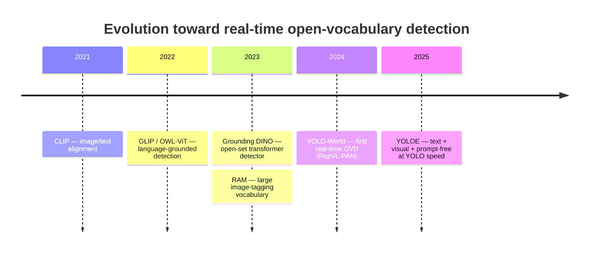
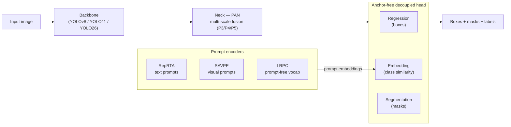
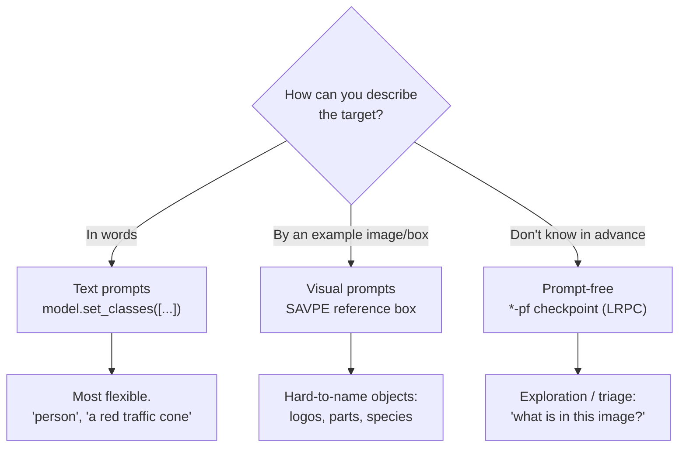
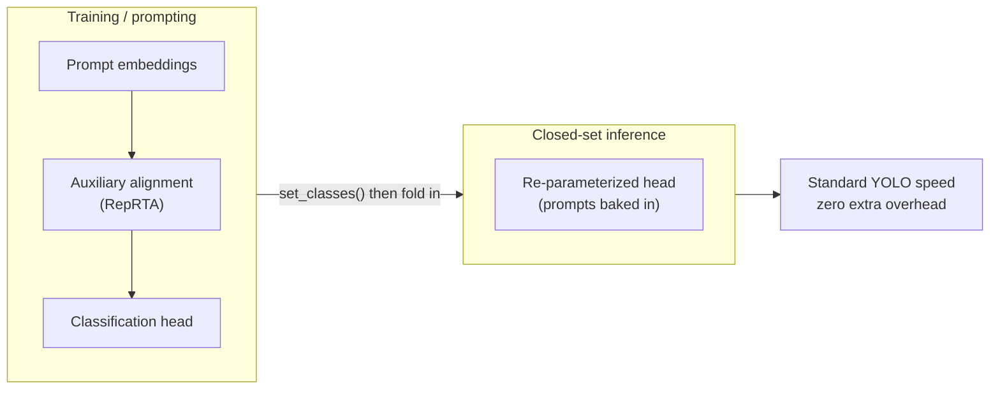
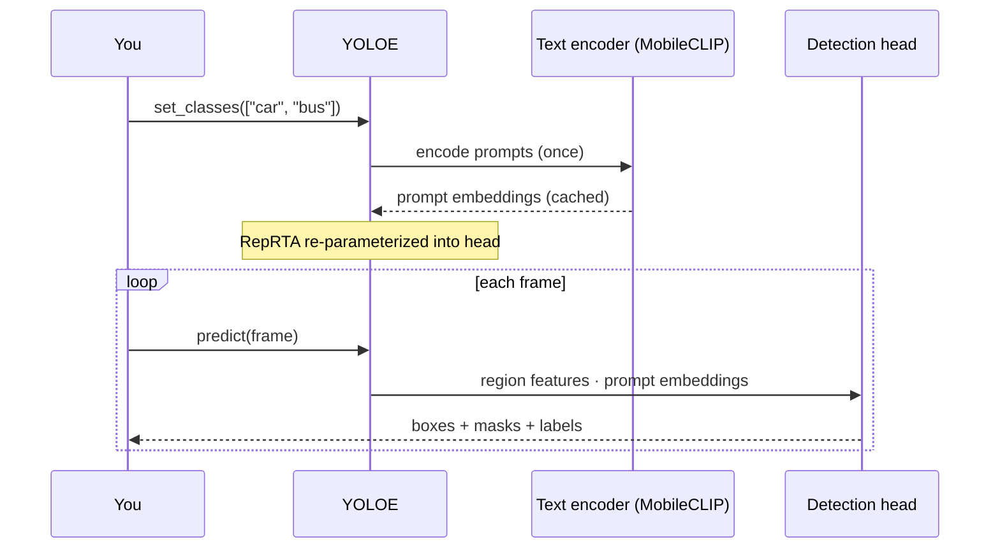
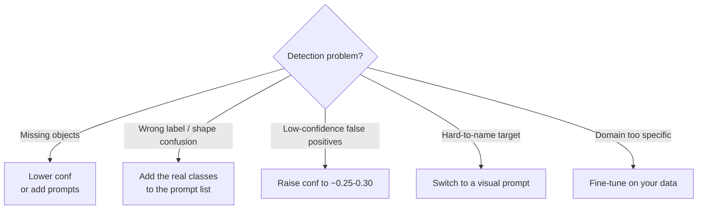
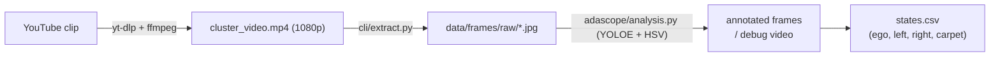

# YOLOE — A Comprehensive Learning Guide to Real-Time Open-Vocabulary Detection

> **Purpose.** A from-scratch, learning-oriented guide to **YOLOE** ("Real-Time
> Seeing Anything", Wang et al., ICCV 2025). It explains *why* open-vocabulary
> detection matters, *how* YOLOE works internally, and *how to use it* — with
> diagrams, code, and a worked example.
>
> This repository applies YOLOE to a concrete case: analyzing the Audi
> *assisted lane change* cluster video. See
> [08_ASSISTED_LANE_CHANGE_CASE_STUDY.md](08_ASSISTED_LANE_CHANGE_CASE_STUDY.md) for
> that hands-on pipeline; this file is the conceptual background behind it.

## Table of contents

1. [Why open-vocabulary detection?](#1-why-open-vocabulary-detection)
2. [The core idea behind YOLOE](#2-the-core-idea-behind-yoloe)
3. [Architecture](#3-architecture)
4. [The three prompting modes](#4-the-three-prompting-modes)
5. [Re-parameterization: the "no free lunch" trick](#5-re-parameterization-the-no-free-lunch-trick)
6. [Benchmarks](#6-benchmarks)
7. [Hands-on: getting started](#7-hands-on-getting-started)
8. [How a prediction flows](#8-how-a-prediction-flows)
9. [Limitations & best practices](#9-limitations--best-practices)
10. [Worked example: assisted lane change](#10-worked-example-assisted-lane-change)
11. [Glossary](#11-glossary)
12. [References](#12-references)

---

## 1. Why open-vocabulary detection?

For a decade, real-time detection meant **closed-set** models. A detector like
YOLOv8 or YOLO11 is trained on a fixed vocabulary (typically the 80 COCO
classes) and at inference can only recognize those categories. A new class means
a new labeled dataset and a new training run — fast and accurate, but rigid.

**Open-vocabulary detection (OVD)** removes the fixed class list. Instead of
hard-coding categories at training time, the model aligns visual features with a
*semantic space* that can be queried at inference — so you can ask for "a red
mug" or "a Bird scooter" without ever training on those labels. The enabling
idea comes from vision-language pre-training, especially **CLIP** [[6]](#12-references).

The field evolved quickly, but most accurate OVD models (transformer-based) ran
well below real-time. YOLOE's contribution is to bring OVD into the **real-time
YOLO regime** while supporting *three* kinds of prompts.



---

## 2. The core idea behind YOLOE

A closed-set head outputs **logits over a fixed class list**. YOLOE instead
scores **similarity between a visual embedding and a prompt embedding**:

```text
closed-set:   score(region) = W · feature(region)          # W is fixed, |classes| rows
YOLOE:        score(region, prompt) = feature(region) · embedding(prompt)
```

Because the head compares against *prompt embeddings* rather than fixed weights,
the vocabulary is **swappable at inference** — supply different prompts and the
same network scores a different class set, with **no retraining** [[1]](#12-references).

The prompt embedding can come from three different encoders (text, visual, or an
internal vocabulary), which is what gives YOLOE its three modes (§4).

---

## 3. Architecture

YOLOE keeps the familiar three-part YOLO structure — **backbone → neck → head** —
and adds three lightweight **prompt encoders** that feed the head.



### 3.1 Backbone

Standard YOLO backbones (YOLOv8, YOLO11, and now YOLO26 via Ultralytics), in S/M/L
scales. Since the backbone is unchanged, YOLOE inherits the base model's speed and
parameter budget [[1]](#12-references), [[2]](#12-references).

### 3.2 Neck

A standard **PAN** (Path Aggregation Network) feature pyramid fusing P3/P4/P5
scales. No open-vocabulary logic lives here — the representation stays shared
across all three prompting modes.

### 3.3 Head

An **anchor-free decoupled head** with three branches: regression (boxes),
embedding (class similarity), and segmentation (masks, YOLACT/YOLOv8-Seg style).
The embedding branch is what makes the head **vocabulary-agnostic**.

### 3.4 The three prompt encoders

| Module | Mode | What it does |
|--------|------|--------------|
| **RepRTA** — Re-parameterizable Region-Text Alignment | Text | Refines pretrained text embeddings (from a **MobileCLIP-B(LT)** text encoder [[7]](#12-references)) through a small auxiliary network, then **re-parameterizes** it into the head at inference (zero overhead) [[1]](#12-references). |
| **SAVPE** — Semantic-Activated Visual Prompt Encoder | Visual | Given a reference image + region, runs an *activation* branch (prompt-aware weights) and a *semantic* branch (prompt-agnostic features), aggregating them into one prompt embedding [[2]](#12-references). |
| **LRPC** — Lazy Region-Prompt Contrast | Prompt-free | Matches each region against a built-in vocabulary (the RAM tag list, ~4,585 categories [[5]](#12-references); embeddings trained on LVIS + Objects365 [[2]](#12-references)) — no external prompt needed. |

---

## 4. The three prompting modes

The same architecture supports three ways of specifying *what* to detect. Pick
based on how you can describe the target:



- **Text prompts** — supply class names; a MobileCLIP text encoder embeds them and
  RepRTA aligns them. Most users start here.
- **Visual prompts** — supply a reference image with a box/mask; SAVPE builds the
  embedding. Good for things text describes poorly.
- **Prompt-free** — `*-pf.pt` checkpoints enumerate a large built-in vocabulary via
  LRPC. Good for bootstrapping datasets or triaging unknown footage.

> Text and visual prompts share the **same weights** — switch without reloading.
> Prompt-free uses a **separate** `-pf` checkpoint, so it loads a different file.

---

## 5. Re-parameterization: the "no free lunch" trick

The headline engineering result: in closed-set use, YOLOE **folds the text-prompt
module into the standard YOLO classification head** at inference. The deployed
model is then architecturally identical to its base YOLO — **same FLOPs, same
speed** — and the open-vocabulary cost only appears when you actively prompt
[[1]](#12-references). YOLO-World introduced the same "re-parameterize prompts as
parameters" idea with its RepVL-PAN [[4]](#12-references).



This is why `set_classes(...)` is a *one-time* cost: it encodes prompts and caches
the embeddings, so per-frame video inference costs the same as a closed-set YOLO.

---

## 6. Benchmarks

Headline results from the paper and Ultralytics docs (640×640, NVIDIA T4 unless
noted) [[1]](#12-references), [[2]](#12-references):

| Claim | Result |
|-------|--------|
| YOLOE-v8-S vs YOLO-Worldv2-S (LVIS, zero-shot) | **+3.5 AP**, 3× less training cost, 1.4× faster |
| YOLOE-v8-L transfer to COCO vs closed-set YOLOv8-L | +0.6 APᵇ / +0.4 APᵐ, ~4× less training time |
| Closed-set parity (COCO) | YOLOE-L ≈ YOLO11-L mAP at identical latency/params |

**How to read this:** the open-vocabulary capability is essentially *free* on a
closed-set workload (re-parameterization, §5), and on the zero-shot LVIS
benchmark YOLOE clearly beats prior real-time OVD models like YOLO-World.

> Numbers move between releases (YOLOE-v8 / YOLOE-11 / YOLOE-26). Always check the
> current [Ultralytics YOLOE docs](https://docs.ultralytics.com/models/yoloe)
> [[2]](#12-references) for the exact figures of the variant you use.

---

## 7. Hands-on: getting started

```bash
pip install ultralytics supervision
```

Ultralytics ships YOLOE and auto-downloads checkpoints (and the MobileCLIP text
encoder) on first use.

### 7.1 Text-prompted detection

```python
from ultralytics import YOLOE

model = YOLOE("yoloe-11l-seg.pt")
names = ["person", "bicycle", "bus", "traffic light", "car"]
model.set_classes(names, model.get_text_pe(names))   # one-time prompt encoding

results = model.predict("street.jpg", conf=0.25, verbose=False)
results[0].show()
```

### 7.2 Prompt-free labeling

```python
pf = YOLOE("yoloe-11l-seg-pf.pt")     # separate checkpoint, no set_classes
results = pf.predict("room.jpg", conf=0.25, verbose=False)
print(sorted({pf.names[int(c)] for c in results[0].boxes.cls}))
```

### 7.3 Video with tracking

```python
model = YOLOE("yoloe-11l-seg.pt")
model.set_classes(["person", "car"], model.get_text_pe(["person", "car"]))
for r in model.track("clip.mp4", persist=True, stream=True, conf=0.2):
    pass   # r.boxes.id holds persistent IDs across frames
```

`model.track(...)` swaps in Ultralytics' built-in tracker, giving each detection a
persistent ID — the basis for counting, dwell time, and trajectories.

---

## 8. How a prediction flows



The key takeaway: text encoding happens **once**; every subsequent frame only pays
for the convolutional backbone + head.

---

## 9. Limitations & best practices

Distilled from the Ultralytics tutorial and common practice:

- **Attributes lower confidence.** `"white horse"` scores lower than `"horse"`
  (~0.68 vs ~0.90) — expected, not a bug. The embedding is more specific.
- **Short prompt lists cause shape confusion.** With only `["laptop"]`, a flat
  notebook can be labeled "laptop". *Fix:* add the real objects to the prompt list,
  or raise `conf` to ~0.25–0.30.
- **Prompt-free is for triage, not exact naming.** A fiddle-leaf fig may surface as
  "eucalyptus tree" — the built-in vocabulary is broad but not exhaustive. Use a
  text prompt for precise names.
- **Missed objects?** Lower `conf` (~0.10) or expand the prompt set. Adding prompts
  is essentially free (§5).
- **For production accuracy** on a narrow domain, a short fine-tuning pass on top of
  YOLOE usually closes the remaining gap.



---

## 10. Worked example: assisted lane change

This repo turns the Audi *assistierter Spurwechsel* clip into a YOLOE test set.
From the clip's narration: the assisted lane change is offered only when route and
traffic allow it — signalled by **two arrows beside a green symbol** in the Virtual
Cockpit — and is **aborted** (shown in red) if another vehicle blocks the lane, a
faster vehicle approaches, or hands leave the wheel.

The pipeline detects those states automatically:



- **YOLOE text prompt** `["car"]` finds the rendered vehicles and assigns each to a
  left / ego / right ROI.
- **HSV colour thresholding** detects the green (available) / red (blocked) carpet
  — more reliable than a learned detector for a flat synthetic overlay.

Full walkthrough, configuration, results, and tuning:
[08_ASSISTED_LANE_CHANGE_CASE_STUDY.md](08_ASSISTED_LANE_CHANGE_CASE_STUDY.md).

---

## 11. Glossary

| Term | Meaning |
|------|---------|
| **OVD** | Open-vocabulary detection — detect classes specified at inference, not training. |
| **Closed-set** | Fixed class list baked in at training (e.g. 80 COCO classes). |
| **RepRTA** | Re-parameterizable Region-Text Alignment — YOLOE's text-prompt module. |
| **SAVPE** | Semantic-Activated Visual Prompt Encoder — YOLOE's visual-prompt module. |
| **LRPC** | Lazy Region-Prompt Contrast — YOLOE's prompt-free module. |
| **PAN** | Path Aggregation Network — the multi-scale feature-fusion neck. |
| **CLIP** | Contrastive Language-Image Pre-training — image/text embedding alignment. |
| **MobileCLIP** | Efficient CLIP variant; provides YOLOE's text encoder. |
| **LVIS** | Large-vocabulary instance-segmentation benchmark (zero-shot OVD standard). |
| **mAP / AP** | Mean Average Precision — standard detection accuracy metric. |

---

## 12. References

1. Wang, Liu, Chen, Lin, Han, Ding. **YOLOE: Real-Time Seeing Anything** (ICCV 2025). arXiv:2503.07465. <https://arxiv.org/abs/2503.07465> · code: <https://github.com/THU-MIG/yoloe>
2. **Ultralytics YOLOE documentation.** <https://docs.ultralytics.com/models/yoloe>
3. Jocher et al. **Ultralytics YOLO11 / YOLO26.** <https://docs.ultralytics.com/models/yolo26>
4. Cheng et al. **YOLO-World: Real-Time Open-Vocabulary Object Detection** (CVPR 2024). arXiv:2401.17270. <https://arxiv.org/abs/2401.17270>
5. Zhang et al. **Recognize Anything: A Strong Image Tagging Model** (CVPRW 2024). arXiv:2306.03514. <https://arxiv.org/abs/2306.03514>
6. Radford et al. **Learning Transferable Visual Models From Natural Language Supervision (CLIP)** (ICML 2021). arXiv:2103.00020. <https://arxiv.org/abs/2103.00020>
7. Vasu et al. **MobileCLIP: Fast Image-Text Models through Multi-Modal Reinforced Training** (CVPR 2024). arXiv:2311.17049. <https://arxiv.org/abs/2311.17049>
8. Liu et al. **Grounding DINO: Marrying DINO with Grounded Pre-Training** (ECCV 2024). arXiv:2303.05499. <https://arxiv.org/abs/2303.05499>
9. Minderer et al. **Simple Open-Vocabulary Object Detection with Vision Transformers (OWL-ViT)** (ECCV 2022). arXiv:2205.06230. <https://arxiv.org/abs/2205.06230>
10. Gupta et al. **LVIS: A Dataset for Large Vocabulary Instance Segmentation** (CVPR 2019). arXiv:1908.03195. <https://arxiv.org/abs/1908.03195>
