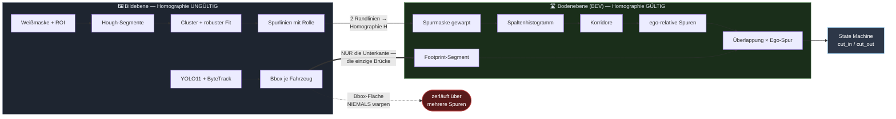
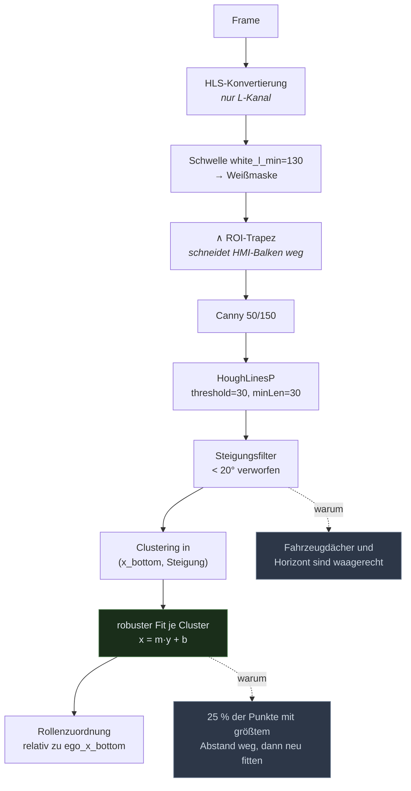
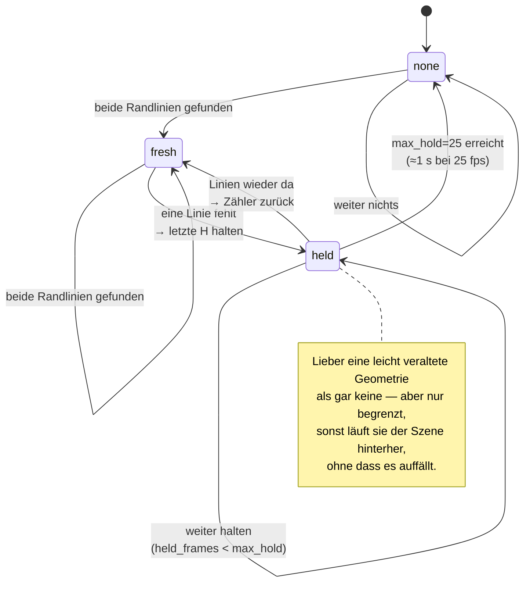
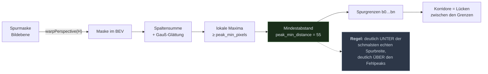
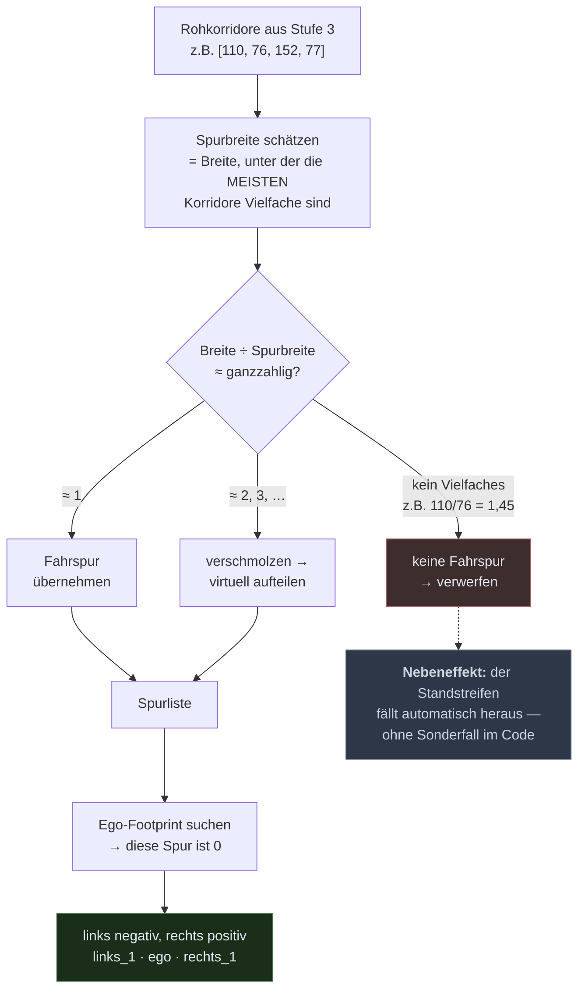
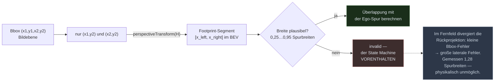
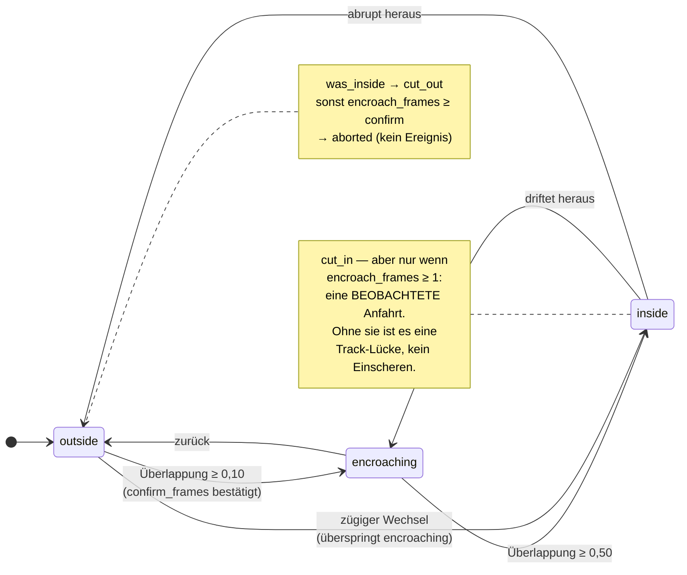
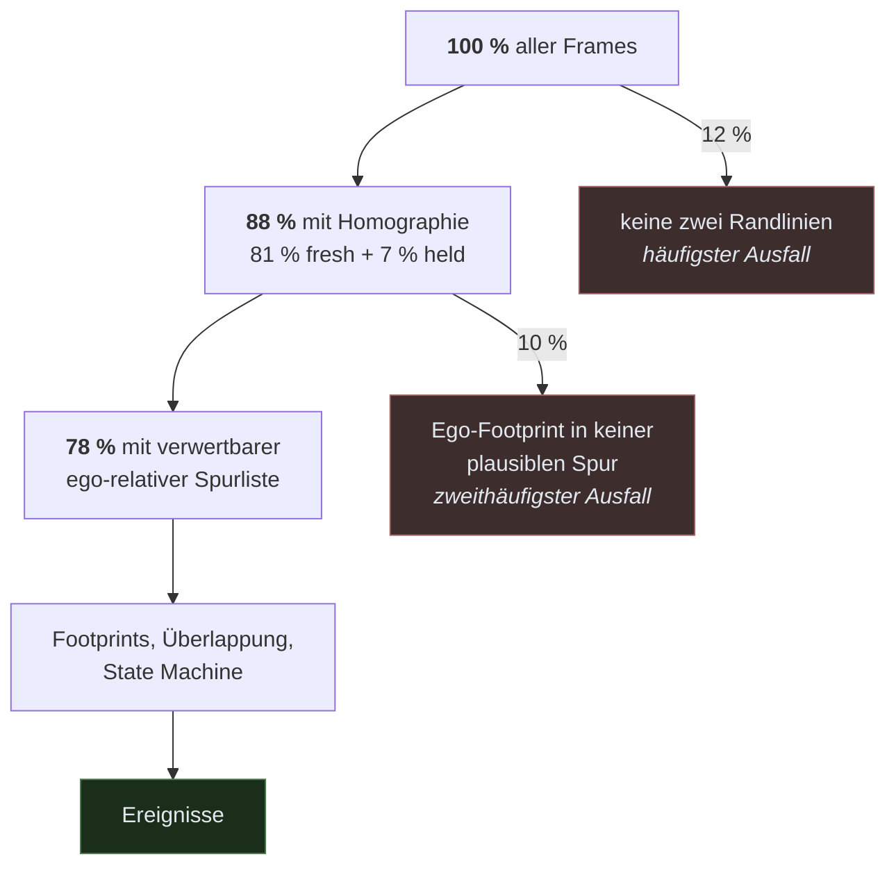

# Die Bildverarbeitungs-Pipeline — und wie sie robuster wird

Diese Doku beschreibt jeden Schritt von der Bilddatei bis zum Cut-In-Ereignis,
sagt für jeden Schritt, **woran er scheitert**, und leitet daraus eine
priorisierte Liste ab. Alle Zahlen sind über die 21 Aufnahmen in `scenarien/`
gemessen und mit `adascope scenarios` reproduzierbar.

---

## 1. Das Kernprinzip: zwei Ebenen, eine Brücke

Alles Weitere folgt aus einer einzigen geometrischen Tatsache: **die
Homographie gilt ausschließlich in der Bodenebene.** Fahrzeuge haben Bauhöhe.
Warpt man sie ins BEV, zerlaufen sie radial vom Kamerapunkt weg und überdecken
mehrere Spuren — eine Flächensegmentierung des Fahrzeugs im BEV ist deshalb
nicht ungenau, sondern strukturell falsch.

Nur ein einziger Teil eines Fahrzeugs liegt nachweislich auf dem Boden: die
**Unterkante seiner Bounding-Box**, die Radaufstandslinie. Sie ist die einzige
Größe, die zwischen den Ebenen wechseln darf.



Die dicke Kante ist die Brücke. Die gestrichelte ist der Fehler, den die erste
Version gemacht hat — sie ist im Debug-Video `debug_smear.mp4` sichtbar: die
magentafarbene Fläche überdeckt mehrere Spuren, die gelbe Unterkante bleibt in
ihrer.

---

## 2. Stufe für Stufe

### Stufe 1 — Bildebene: von Pixeln zu Spurlinien

`adascope/lanes/detection.py`, Kalibrierung in `configs/lane.yaml`



**Warum `x = m·y + b` und nicht `y = m·x + b`:** Spurlinien sind im Bild nahezu
senkrecht. In der üblichen Form wäre ihre Steigung unendlich; nach `y`
aufgelöst bleibt sie endlich und der Fit stabil.

**Der robuste Fit** (grün) ist die jüngste Härtung. Gemessen über 1573 Cluster
aus allen Aufnahmen:

| | Residuum Grad 1 | Grad 2 (mehr Modell) | getrimmt (Ausreißer weg) |
|---|---|---|---|
| alle Cluster | 2,72 px | 2,60 px (−5 %) | 1,87 px (**−31 %**) |
| oberstes Sagitta-Dezil | 19,24 px | 16,21 px (−16 %) | 3,10 px (**−84 %**) |

Die Störung sind **Ausreißer**, nicht Krümmung: ein höherer Polynomgrad bringt
16 %, das Wegwerfen weniger Punkte 84 %. Deshalb getrimmter Ausgleich und nicht
RANSAC — bei kleinem Ausreißeranteil ist ein reproduzierbares Ergebnis mehr
wert als Zufallsproben.

### Stufe 2 — Homographie mit Gedächtnis

`adascope/lanes/bev.py` + `pipeline.py`, Kalibrierung in `configs/bev.yaml`

Die beiden **äußersten** durchgezogenen Linien werden auf `x_left` / `x_right`
abgebildet. Warum „äußerste" und nicht einfach `{L.role: L}`: bei mehreren
Linien derselben Rolle behielt die Komprehension stumm die *innere* — in 41 %
der Frames — und zog die Homographie schief, ohne einen Fehler zu werfen.

Nicht jeder Frame liefert beide Linien. Deshalb ein Zustandsautomat:



Gemessen über alle 21 Aufnahmen: **81 % `fresh`, 7 % `held`, 12 % `none`**.
Die 12 % sind die harte Obergrenze für alles Nachgelagerte — ohne Homographie
gibt es keine Bodenebene und damit kein Ereignis.

> ⚠️ **Die BEV-Skala ist nicht metrisch.** Die zwei gefundenen Linien werden auf
> feste 338 px abgebildet — egal, ob zwei oder vier Spuren dazwischen liegen.
> Gemessen: 2 Korridore → 168 px/Spur, 4 Korridore → 77 px/Spur. Dieselbe
> Pixelbreite bedeutet je nach Abschnitt eine andere reale Breite. **Das ist die
> wichtigste offene Schwäche** — siehe Abschnitt 4.

### Stufe 3 — Bodenebene: Korridore aus dem Spaltenhistogramm

Die Spurmaske wird gewarpt und spaltenweise aufsummiert. Gestrichelte Linien
akkumulieren dabei zu Säulen — genau die kurzen Fern-Dashes, die Hough in der
Bildebene verliert, werden hier stabil.



**`peak_min_distance` war der teuerste Einzelwert des Projekts.** Bei 25 px —
einem Drittel der schmalsten echten Spurbreite — überlebten Kleinstkorridore
von 25…42 px. Auf dem Referenz-Einzelbild fiel das nicht auf; im Video griff
die Spurbreitenschätzung genau diese Fehlpeaks ab und lieferte 30 statt 76 px.
Auf 55 angehoben: Index-Sprünge von **12,0 % auf 4,5 %**, verwertbare
Spurlisten von 53 % auf 100 % auf demselben Abschnitt.

### Stufe 4 — Ego-relative Nummerierung

`adascope/lanes/indexing.py`, Kalibrierung in `configs/indexing.yaml`

Positionsbasierte Indizes (L0…Ln von links) rutschen, sobald eine Grenze
ausfällt — Falschalarm ohne Szenenänderung. Zwei Maßnahmen:



**Warum das den Fehlermodus auflöst:** fällt eine Grenze *außerhalb* der Spanne
zwischen Ego und Zielfahrzeug aus, verschieben sich beide gleich — die Differenz
kürzt sich weg. Fällt eine *dazwischen* aus, verschmelzen zwei Korridore, und
genau das erkennt die Breitenprüfung.

Im Debug-Video `debug_bev.mp4` sind beide Nummerierungen übereinander zu sehen:
graue Linien sind die Rohpeaks, weiße die übernommenen Grenzen, orange
gestrichelte die virtuell rekonstruierten.

### Stufe 5 — Die Brücke: nur die Unterkante



Die Plausibilitätsprüfung **verwirft statt zu raten**. Sie definiert damit die
nutzbare Detektionsreichweite — deutlich kürzer, als das BEV-Bild suggeriert.
Ein geglätteter falscher Wert wäre schlechter als eine Lücke: die State Machine
kann mit fehlenden Messungen umgehen, mit falschen nicht.

### Stufe 6 — Ereignisse über die Zeit

`adascope/lanes/events.py`, Kalibrierung in `configs/events.yaml`

Ein Schwellwert liefert pro Frame eine Aussage, aber kein *Ereignis*. Drei
Fälle unterscheidet er nicht: abgebrochener Wechsel, Flackern, eigener
Spurwechsel.



Die beiden Merker `encroach_frames` und `was_inside` sind nicht kosmetisch —
sie sind die Korrektur dreier Defekte, die auf unannotiertem Material als
„keine Ereignisse" erschienen:

| Defekt | Symptom | Ursache |
|---|---|---|
| Zügiger Wechsel fiel stumm aus | Überlappung 0,00 → 0,36 → 0,65 → 1,00, **kein cut_in** | Flagge nur bei *bestätigtem* Zwischenzustand gesetzt; ein Frame im Band reicht dafür nicht |
| Langsames Ausscheren als `aborted` | Fahrzeug war nachweislich drin | `cut_out` verlangte `prev == inside`; über `encroaching` ist `prev` aber `encroaching` |
| Falscher `ego_lane_change` | löschte zwei echte Ereignisse | zwei gleichsinnig wechselnde Fahrzeuge sehen aus wie eine Eigenbewegung |

Der dritte ist jetzt durch die **Ego-Bewegung selbst** belegt: ein eigener
Spurwechsel wird nur anerkannt, wenn der Ego-Footprint dabei auch wirklich
seine Spurgrenze berührt (`ego_departure_max: 0.90`).

---

## 3. Wo die Frames verloren gehen

Die entscheidende Frage für Robustheit ist nicht „funktioniert es", sondern
„wie viele Frames überleben jede Stufe". Gemessen über alle 21 Aufnahmen:



Die beiden roten Kästen sind die Hebel — in dieser Reihenfolge. Alles, was an
der State Machine getunt wird, wirkt nur auf den 78 %.

---

## 4. Wie es robuster wird — priorisiert

### 1. Metrische Skala aus der Strichperiodik ⭐ größter Hebel

**Problem, gemessen:** die geschätzte Spurbreite schwankt über die Aufnahmen
zwischen **55 und 144 px — Faktor 2,6.** Ursache ist die nicht-metrische
BEV-Skala aus Stufe 2: die zwei Randlinien werden immer auf 338 px abgebildet,
egal wie viele Spuren dazwischen liegen.

**Folge:** `indexing.multiple_tolerance = 0,18` kann einen Faktor 2 nicht
auffangen. Ein fest gesetztes `lane_width` ist auf gemischtem Material falsch,
die Schätzung auf Abschnitten mit wenigen Korridoren unzuverlässig.

**Lösung:** deutsche Autobahn-Strichmarkierung hat eine bekannte Periodik —
6 m Strich + 12 m Lücke = **18 m Periode**. Ein Autokorrelationsmaximum des
BEV-Spaltenprofils *längs* liefert daraus px/m, unabhängig davon, wie viele
Spuren die Randlinien einschließen.

**Wirkung:** macht `estimate_lane_width()` überflüssig, `lane_indexing`
fahrbahntyp-unabhängig und die Footprint-Plausibilität absolut statt relativ.

### 2. Ego-Footprint zuverlässiger zuordnen — teilweise erledigt ✅

**Das Problem war zur Hälfte die Spurbreitenschätzung.** *„Ego-Footprint liegt
in keiner plausiblen Spur"* war mit 198 Frames der zweithäufigste Ausfallgrund.
Ursache bei `acc_plus_6`: Korridorbreiten `[103, 80, 77, 80, 59]`. Die alte
Heuristik nahm das **Minimum** — den am Bildrand angeschnittenen 59-px-Korridor.
Damit war `80/59 = 1,36` kein ganzzahliges Vielfaches, **vier von fünf**
Korridoren fielen als „keine Spur" heraus, und das Ego lag in keiner mehr.

Die Schätzung nimmt jetzt die Breite, unter der die **meisten** Korridore
Vielfache sind — hier 79 px. Wirkung:

| | vorher | nachher |
|---|---|---|
| verwertbare Spurliste gesamt | 78 % | **82 %** |
| `acc_plus_6` | 43 % | **100 %** |
| `lane_departure_1_lane` | 2 % | **63 %** |

**Was bleibt:** bei `acc_plus_7`, `adjusting_speed_scenario_5/6/8` ist es
weiterhin der häufigste Ausfall. Dort ist die Ego-Ankerzone
(`tracking.ego_zone`) die Ursache — sie ist auf den kalibrierten Zuschnitt
getunt und wählt auf anderen Ausschnitten ein Fremdfahrzeug als Ego. Die
Ego-Wahl sollte über Persistenz laufen: das Ego ist das Fahrzeug, dessen
Footprint über viele Frames im selben Korridor bleibt. `debug_front.mp4` zeigt
die aktuelle Wahl gelb.

### 3. Spurgrenzen zeitlich verfolgen

Heute wird das Spaltenhistogramm in **jedem Frame neu** ausgewertet. Eine
Strichlücke lässt eine Grenze verschwinden, der nächste Frame findet sie wieder
— das ist die Quelle der verbleibenden Index-Sprünge (0…25 % je Aufnahme).

**Lösung:** Grenzen über Frames matchen (nächster Nachbar innerhalb weniger
Pixel), kurzzeitiges Fehlen überbrücken statt neu durchzunummerieren. Das
`lanes.indexing` fängt heute nur den Teil auf, der sich wegkürzt.

### 4. Homographie zeitlich glätten

Aktuell wird die letzte gültige Abbildung **gehalten**, nicht gefiltert. Ein
Ausreißer-Frame prägt die Geometrie dann bis zu 25 Frames lang. Ein gleitendes
Mittel über die vier Stützpunkte, gewichtet nach Support der Linien, kostet
wenig und dämpft das.

### 5. Kurven — Sliding Windows sind gebaut, aber kein Standard

`configs/windows.yaml`, `method: histogram | windows`

Das Spaltenhistogramm setzt **senkrechte** Säulen voraus, also gerade Spuren. In
einer Kurve wandert dieselbe Linie über viele Spalten und die Summe verschmiert.
Sliding Windows laufen stattdessen fensterweise von unten nach oben, führen die
Fenstermitte den Pixeln nach und fitten aus den Mitten ein Polynom 2. Grades.

**Auf synthetischen Kurven ist die Sache eindeutig** — die höchste Säule fällt
schon bei mäßiger Krümmung um rund 75 %:

| Krümmung | höchste Säule | Histogramm findet | Fenster finden |
|---|---|---|---|
| 0 | 658 | 4 Grenzen | 4 |
| 120 | 137 (**−79 %**) | 4, aber im Fernfeld daneben | 4, treffend |
| 300 | 102 | **3 — eine fehlt** | 4 |

**Auf dem aktuellen, nahezu geraden Material ist es kein durchgängiger Gewinn**
(je 100 Frames, `histogram → windows`):

| Szenario | Spurliste | Index-Sprünge |
|---|---|---|
| acc_plus_1_vid | 100 % → 100 % | 12 → **0** |
| acc_plus_4 | 94 % → 88 % | 37 → **0** |
| acc_plus_6 | **43 % → 99 %** | 4 → 21 |
| acc_plus_2 | 99 % → 93 % | 0 → **29** |
| acc_plus_7 | 57 % → 70 % | 6 → 23 |

Kosten rund **13 → 25 ms** je Frame. Faustregel: wo die Spurliste unter ~70 %
liegt, ist `windows` einen Versuch wert; wo sie nahe 100 % liegt, verschlechtert
es eher. Deshalb bleibt `histogram` der Standard und die Umstellung ist eine
Einzelfallentscheidung je Aufnahme — ein Dreizeiler im Szenario-Overlay.

**Nebenbei entstanden:** Grenzen sind jetzt Polynome und werden **dort
ausgewertet, wo das Fahrzeug steht**, statt über die volle BEV-Höhe gemittelt.
Für gerade Spuren ändert das nichts (Polynom vom Grad 0), in einer Kurve ist es
der Unterschied zwischen richtig und falsch.

> **Die Grenze des Verfahrens.** Ab starker Krümmung scheitert schon die
> **Bildebene**: der Geradenfit in Stufe 1 findet die beiden durchgezogenen
> Randlinien nicht mehr, es gibt keine Homographie, und die Fenster kommen gar
> nicht zum Zug (gemessen ab Krümmung ~220). Sliding Windows sind für Kurven
> nötig, aber **nicht hinreichend** — der Fit in der Bildebene braucht dieselbe
> Modellkapazität. Das ist die nächste Arbeit an dieser Stelle.

> **RANSAC löst Krümmung nicht.** RANSAC sucht die größte Teilmenge, die zum
> *gegebenen* Modell passt. Fittet man mit RANSAC eine Gerade an eine Kurve,
> findet es ein gerades Teilstück und verwirft den Rest der Spur als Ausreißer —
> ein selbstbewusst aussehender Fit über die halbe Spur. Krümmung ist ein
> Modell-Problem, kein Ausreißer-Problem.

### 6. Annotationen — Ereignisse und Wahrnehmung getrennt nachweisen

Ohne positive Spurwechselaufnahme ist positiver Event-Recall nicht messbar.
Negative Annotationen bleiben trotzdem wertvoll: `events: []` macht jede
Meldung zum messbaren Falschalarm und berichtet Recall als N/A. Geometrische
Qualitaet wird davon getrennt auf manuell ausgewaehlten Frames bewertet.

```powershell
copy ground_truth\VORLAGE.yaml ground_truth\<szenario>.yaml
python scripts\annotate_perception.py <szenario> --frames 0,50,100
python scripts\stage_09_perception_eval.py --source scenarien\<szenario>
adascope scenarios <szenario> --views dash
adascope scenarios                            # Rückgabewert 0 = alles erfüllt
```

---

## 5. Was schon abgesichert ist

**374 Tests, kein Test lädt ein Modell.** Drei Ebenen:

**Synthetische Szenen** (`adascope/synthetic.py`) geben die Trajektorie vor und
erzeugen das Bild daraus. Die Pipeline muss die vorgegebenen Ereignisse
zurückliefern — das prüft die ganze Kette unter bekannter Wahrheit. Die Szene
reproduziert ihre eigene Vorgabe exakt: Grenzen `[81, 194, 306, 419]` wie
gesetzt, Spurbreite 112,7 = 112,7.

Abgedeckt: sauberes Einscheren · Ausscheren · abgebrochener Wechsel · zwei
Fahrzeuge gleichzeitig · Einscheren bei ausgefallenem Fernbereich · Einscheren
unter Rauschen und Störstrichen · Fernfeldartefakte · Zeitpunkt des Ereignisses.

**Annotierte Aufnahmen** (`ground_truth/`) bewerten Treffer, Fehlerkennungen und
Falschalarme mit Frame-Toleranz. `adascope scenarios` liefert Rückgabewert 0 nur,
wenn jede vorhandene Annotation erfüllt ist — CI-tauglich.

**Frameweise Wahrnehmungs-Ground-Truth** bewertet Richtungsflaechen-IoU,
BEV-Grenzen, Spurzahl, Ego-Spurposition und optionale Fahrzeugspurzuordnungen.
Fehlende Felder sind N/A und werden nicht als Erfolg gezaehlt.

---

## 6. Woran man welchen Fehler erkennt

| Ansicht | zeigt | Verdacht bei |
|---|---|---|
| `debug_front.mp4` | Hough-Linien mit Rolle und Support, Tracks, Ego-Wahl | Rollen falsch zugeordnet, Ego-Wahl daneben |
| `debug_mask.mp4` | Weißmaske, Canny, Hough-Cluster; verworfene grau | ROI schneidet zu viel/wenig, Helligkeitsschwelle falsch |
| `debug_hist.mp4` | Spaltenhistogramm mit Peaks und Schwelle | zu viele/wenige Grenzen, `peak_min_*` falsch |
| `debug_bev.mp4` | Rohkorridore **gegen** rekonstruierte Spuren | Indizierung verwirft oder erfindet Spuren |
| `debug_smear.mp4` | Bbox-Fläche vs. projizierte Unterkante | Verständnis, warum nur die Kante zählt |
| `debug_oblique/shoulder.mp4` | dieselbe Bodenebene aus anderem Winkel | Längsversatz, Fernfeld-Divergenz |
| `debug_dash.mp4` | alles zusammen + Zeitverlauf + Ereignislog | Erster Blick immer hier |

Der **Zeitstreifen** unter `dash` ist der schnellste Einstieg: Homographie-Zustand
als Farbband, `len(corridors)` in Weiß gegen die Anzahl ego-relativer Spuren in
Cyan. Springt Weiß, ohne dass Cyan springt, hat die Indizierung einen Ausfall
aufgefangen — genau ihr Zweck.
