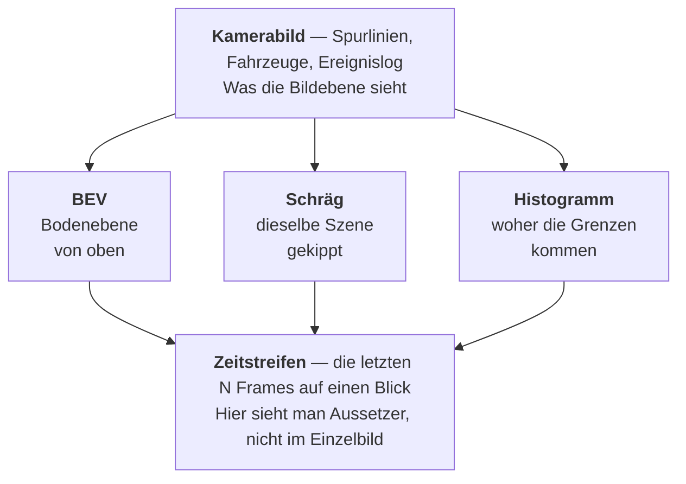

# Das Debugvideo lesen

Für `results/<aufnahme>/debug_dash.mp4`. Die anderen Ansichten (`front`,
`bev`, `hist`, `mask`, `oblique`, `smear`, `shoulder`) zeigen je eine Stufe
einzeln — `dash` fasst sie zusammen und ist die Ansicht, mit der man anfängt.

---

## Der Aufbau



Die obere Hälfte ist **dieser Frame**, der Streifen unten ist **der Verlauf**.
Fast alle Fragen beantwortet der Streifen, nicht das Bild.

---

## Der Zeitstreifen, von oben nach unten

### Band 1 — Homographie (dünne senkrechte Striche ganz oben)

Die Abbildung Bildebene → Bodenebene. **Ohne sie ist der Frame stumm.**

| Farbe | Zustand | Bedeutung |
|---|---|---|
| 🟩 grün | `fresh` | in diesem Frame neu aus zwei Randlinien berechnet |
| 🟧 orange | `held` | keine Randlinien gefunden, die letzte gültige wird weiterverwendet |
| 🟥 rot | `none` | auch das Halten ist abgelaufen — **hier wird nichts ausgewertet** |

> **Warum du „keine Homographie" öfter siehst, als die Statistik sagt.**
> Über alle 21 Aufnahmen liegt `none` bei **0,3 %** der Frames. Im Video wirkt
> es nach mehr, weil rote Striche gebündelt auftreten: fällt die Erkennung aus,
> fällt sie meist für mehrere Frames am Stück aus. Ein Block von 8 roten
> Strichen fällt auf, 8 einzelne über die ganze Aufnahme verteilt nicht.
>
> Prüfe zuerst, ob es 🟧 orange statt 🟥 rot ist. Orange ist **kein Ausfall** —
> die Geometrie steht, sie ist nur ein paar Frames alt. Das ist der Normalfall
> und über weite Strecken beabsichtigt.

### Band 2 — Ego-Spurhaltung (Punktkurve, eigene Achse)

Wie viel vom eigenen Fahrzeug in der eigenen Spur liegt. `1.0` = vollständig.

- 🟦 cyan: ≥ 1,0, alles in der Spur
- 🟧 orange: darunter — das Ego **verlässt gerade seine Spur**

Fällt die Kurve und steigt wieder, ohne dass unten ein Ereignis markiert ist,
war es ein Ausweichen oder Schwenken, kein Spurwechsel. Fällt sie und bleibt
unten, hat das Ego gewechselt — dann *muss* unten eine Marke stehen.

### Band 3 — Zählplot (zwei Punktkurven, Achse links)

- ⬜ **weiß: Rohkorridore** — was die Grenzensuche gefunden hat
- 🟦 **cyan: ego-relative Spuren** — was nach der Plausibilitätsprüfung übrig ist

**Das ist der wichtigste Vergleich im ganzen Video.** Springt Weiß, während Cyan
ruhig bleibt, hat die Indizierung einen Ausfall aufgefangen — das System
arbeitet wie gedacht. Springen beide gemeinsam, ist der Sprung echt bis in die
Auswertung durchgeschlagen.

Dass Weiß zappelt, ist normal und meist korrekt: am BEV-Rand werden echte
Markierungen sichtbar und verschwinden wieder. Gemessen sind 0 % der Korridore
zu schmal, 70–78 % messen exakt eine Spurbreite.

### Band 4 — orangene Marken direkt über dem Plot

Sprünge des **positionsbasierten** Ego-Index. Das ist eine *Messgröße*, kein
Eingang: sie zeigt den Fehlermodus, den die ego-relative Nummerierung auflöst.
Viele orangene Marken bei ruhiger cyaner Kurve = genau der Zweck des Verfahrens.

### Band 5 — Ereignisse (Striche ganz unten)

| Farbe | Ereignis |
|---|---|
| 🟥 rot | `cut_in` — ein Fremdfahrzeug schert ein |
| 🟩 grün | `cut_out` — ein Fremdfahrzeug schert aus |
| 🟦 blau | `ego_lane_change` — eigener Spurwechsel |
| ⬜ grau | `aborted` — Annäherung wieder abgebrochen |

---

## Das Kamerabild oben

**Spurlinien** nach Rolle: 🟧 orange `*_solid` (außen), 🟩 grün `*_dashed`
(ego-nächste), 🟥 rot `unknown`.

> Die Rollennamen sind **positionell, nicht gemessen** — keine Stufe prüft, ob
> eine Linie wirklich durchgezogen ist. „solid" heißt hier nur „weiter außen als
> die ego-nächste". Genau diese Verwechslung hatte vier Aufnahmen totgelegt
> (siehe [12_OFFENE_PUNKTE.md](12_OFFENE_PUNKTE.md), Punkt 2).

**Fahrzeuge** nach Zustand der State Machine: 🟩 grün `outside`, 🟧 orange
`encroaching` (zwischen den Spuren), 🟥 rot `inside`, ⬜ grau ungültig.
🟦 blau = erkannt, aber nicht verfolgt.

**Unten links** das Ereignislog der letzten Ereignisse im Klartext.

---

## In der BEV-Ansicht

- ⬜ **weiße Linien**: gemessene Spurgrenzen
- 🟧 **orange gestrichelt**: **rekonstruierte** Grenze — aus einem verschmolzenen
  Korridor geteilt, also eine Annahme, keine Beobachtung. Genau deshalb lehnt
  die Mapping-Schicht absolute Spurnummern ab, sobald eine davon im Spiel ist.
- 🟨 **gelbe Segmente**: Footprints — die auf den Boden projizierten
  Bbox-Unterkanten. **Nur die Unterkante** ist gültig; Fahrzeuge haben Bauhöhe
  und verlaufen im BEV radial.

---

## Diagnose: Symptom → wohin schauen

| Was du siehst | Was es bedeutet | Nächster Schritt |
|---|---|---|
| Viele 🟥 rote H-Striche | Randlinien werden nicht gefunden | `--views front,mask` — ROI, Schwelle, Cluster |
| Viele 🟧 orange H-Striche | normal, Geometrie ist gehalten | nichts |
| Weiß zappelt, Cyan ruhig | Indizierung fängt es auf | nichts |
| Weiß **und** Cyan springen | Sprung schlägt durch | `--views hist` — Peaks ansehen |
| Viel 🟧 orange gestrichelt | viele Grenzen rekonstruiert | `bev.peak_min_distance` prüfen |
| Ego-Kurve fällt, keine Marke | Wechsel nicht erkannt **oder** keiner | annotieren und `adascope scenarios` |
| Ereignisse in Salven | State Machine prellt | `events.confirm_frames` |

```powershell
adascope scenarios <name> --views dash,front,mask,hist,bev
```

---

## Was das Video **nicht** beantwortet

Die Kennzahlen sagen, ob die Pipeline *durchläuft* — nicht, ob sie **recht hat**.
„Keine Ereignisse" ist ohne Annotation nicht von „nichts erkannt" zu
unterscheiden. Genau diese Verwechslung hatte drei Defekte in der State Machine
verdeckt.

**1 von 21 Aufnahmen ist annotiert.** Vorlage: `ground_truth/VORLAGE.yaml`,
Bewertung mit `adascope scenarios <name>` (Rückgabewert 0 = Annotation erfüllt).
